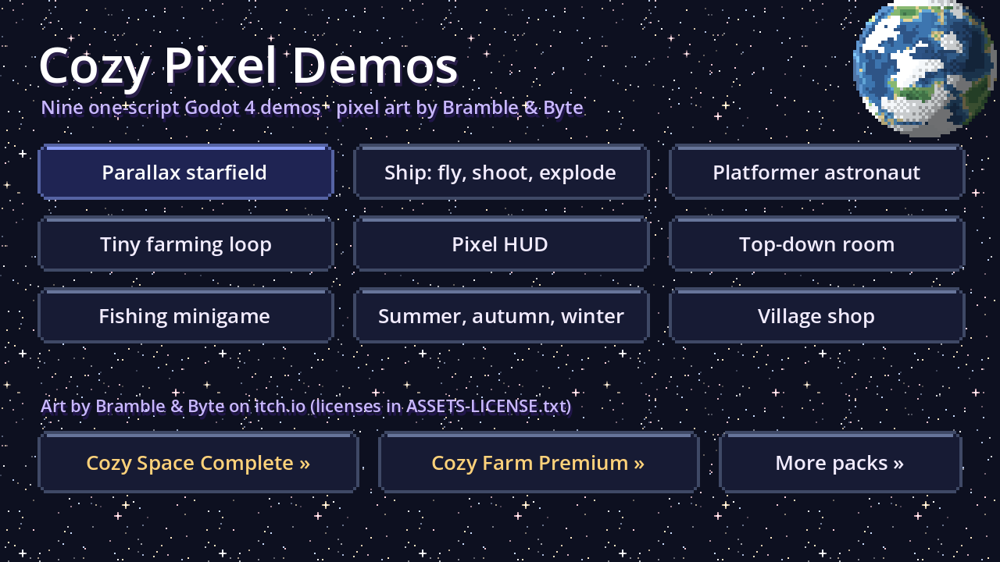
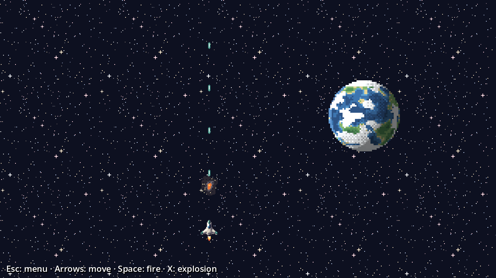
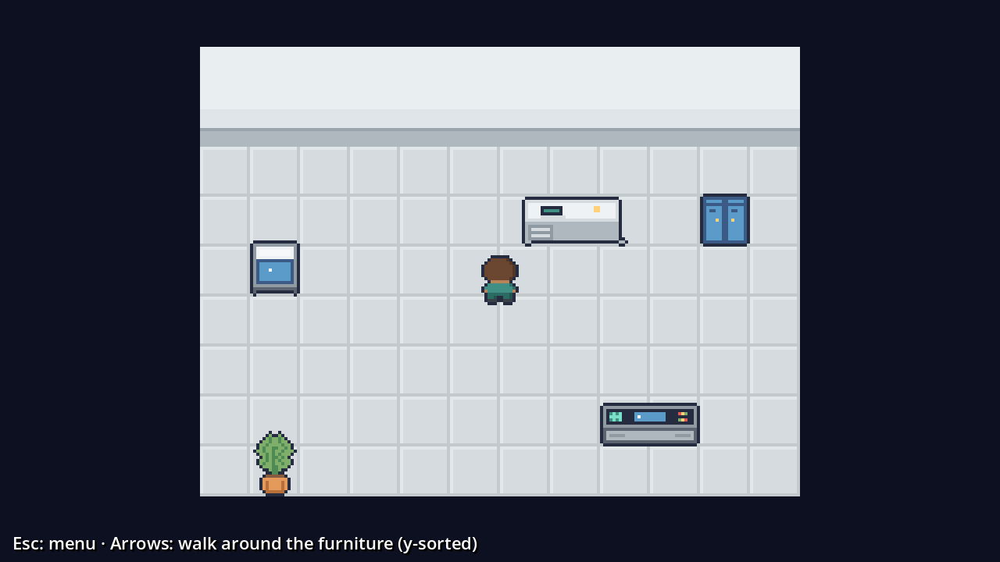

# Cozy Pixel Demos for Godot 4

Nine small Godot 4 demos, each one script you can read in a minute, using 16 px pixel art by **Bramble & Byte**.

**▶ Play it in your browser:** https://aquumgifts.github.io/cozy-pixel-godot-demos/

| Demo | What it shows | Art |
|---|---|---|
| Parallax starfield | three star layers scrolling forever with `Parallax2D`, a turning planet | [Cozy Space Backdrops](https://aquumgifts.itch.io/cozy-space-backdrops) |
| Ship: fly, shoot, explode | engine flame animation, lasers, an `AnimatedSprite2D` explosion | [Cozy Space Ships](https://aquumgifts.itch.io/cozy-space-ships) |
| Platformer astronaut | `CharacterBody2D` with gravity, jump, idle/run/jump/fall animations | [Cozy Space Platformer](https://aquumgifts.itch.io/cozy-space-platformer) |
| Tiny farming loop | walk, plant, watch the carrot grow, harvest | [Cozy Farm](https://aquumgifts.itch.io/cozy-farm) |
| Pixel HUD | 9-slice panel, oxygen bar, texture button | [Cozy Space Icons & UI](https://aquumgifts.itch.io/cozy-space-icons-ui) |
| Top-down room | tiled floor, y-sorted furniture, a walking crew member | [Interiors](https://aquumgifts.itch.io/cozy-space-interiors), [Furniture](https://aquumgifts.itch.io/cozy-space-furniture), [Tiny Crew](https://aquumgifts.itch.io/cozy-space-tiny-crew) |
| Fishing minigame | walk the dock, cast, wait for the bite, reel in | [Cozy Farm Fishing](https://aquumgifts.itch.io/cozy-farm-fishing) (Lite is free) |
| Summer, autumn, winter | the same farm swapping seasons, tile by tile | [Cozy Farm Seasons](https://aquumgifts.itch.io/cozy-farm-seasons) |
| Village shop | walk into a shop, 9-slice panel, buy with coins | [Cozy Farm Village](https://aquumgifts.itch.io/cozy-farm-village), [Cozy Farm UI](https://aquumgifts.itch.io/cozy-farm-ui) |

## Run it

Open the folder in Godot 4.3 or newer and press F5. Pick a demo from the menu; **Esc** goes back.
Each demo is a single script in `demos/`. The space and first farm demos match step-by-step tutorials on itch.io:
[parallax](https://aquumgifts.itch.io/cozy-space-backdrops/devlog/1694708/tutorial-a-scrolling-parallax-starfield-in-godot-4-with-free-pixel-art) ·
[ship](https://aquumgifts.itch.io/cozy-space-ships/devlog/1694712/tutorial-a-ship-that-flies-shoots-and-explodes-in-godot-4-one-script-free-pixel-art) ·
[astronaut](https://aquumgifts.itch.io/cozy-space-platformer/devlog/1695246/tutorial-a-running-jumping-astronaut-in-godot-4-one-script-free-pixel-art) ·
[farm](https://aquumgifts.itch.io/cozy-farm/devlog/1695257/tutorial-a-tiny-farming-loop-in-godot-4-walk-plant-grow-harvest-one-script) ·
[HUD](https://aquumgifts.itch.io/cozy-space-icons-ui/devlog/1695264/tutorial-a-pixel-art-hud-in-godot-4-9-slice-panel-oxygen-bar-button-one-script) ·
[room](https://aquumgifts.itch.io/cozy-space-interiors/devlog/1695295/tutorial-a-walkable-top-down-room-in-godot-4-with-y-sorted-furniture-one-script).

Pixel-art settings already set in `project.godot`: nearest texture filter, 640 × 360 viewport, `canvas_items` stretch.

## Get the full packs

This project only carries the few sprites the demos use. The full packs are free on itch.io (name your own price):
ships in 3 color schemes, 8 rotating planets, 12 tiny crew members, 23 furniture props, platformer autotiles, 10 crops, villagers and more.

**Every Cozy Space pack in one download:** [Cozy Space Complete](https://aquumgifts.itch.io/cozy-space-complete), all 16 packs plus the Story Kit, a ready Tiled map and the master palette.
**Every Cozy Farm art pack in one download:** [Cozy Farm Premium](https://aquumgifts.itch.io/cozy-farm-premium).
More packs: [aquumgifts.itch.io](https://aquumgifts.itch.io).

## License

- Code (`*.gd`, scenes, project files): MIT, see `LICENSE`.
- Art in the pack folders (`cozy-*`): see `ASSETS-LICENSE.txt`. The space folders and `cozy-farm/` are CC-BY 4.0 (credit "Cozy Space" / "Cozy Farm" by Bramble & Byte); the fishing sprites come from the free Fishing Lite pack; the few Seasons, Village and UI sprites are from paid packs and are only for running and studying these demos.
